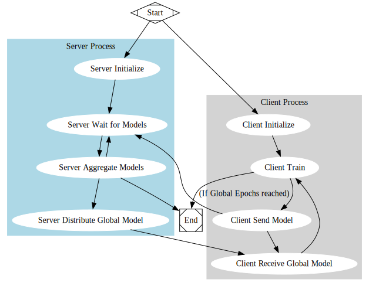

> This project demonstrates a Federated Learning (FL) setup implemented in C, where a **server** and multiple **clients** communicate via sockets. The **clients** train locally on partitions of a dataset, share their model updates with the **server**, and receive the updated global model. This process repeats for several global epochs.

---

## Features
1. **Server Initialization**: The server handles client connections and orchestrates the federated learning process.
2. **Client Registration**: Clients register with the server, receive their dataset partition, and begin local training.
3. **Local Training**: Clients perform training for a fixed number of local epochs.
4. **Model Aggregation**: The server normalizes and aggregates models received from all clients.
5. **Global Model Distribution**: After aggregation, the updated global model is sent back to all clients.
6. **Iterative Training**: The process repeats until the specified number of global epochs is completed.

## Getting Started
```bash
git clone https://github.com/hyouteki/cerberus --recursive --depth=1
cd cerberus/malpractice
./build.sh
cd ..
./build.sh
```

## Program Workflow

### 1. Server Initialization
The **server**:
- Initializes itself and listens on the configured port.
- Partitions the dataset into chunks for the clients.

### 2. Client Registration
Each **client**:
- Registers with the server by connecting over a socket.
- Receives its unique ID and a data chunk from the server.
- Is added to the server's client list.

### 3. Local Training
Clients perform local training for `LocalEpochs` using their assigned data chunk. They use:
- A neural network with:
  - Input size: `784`
  - Hidden size: `128`
  - Output size: `10`
- Learning rate: `0.01`

### 4. Model Sharing
After local training, clients:
- Send their local models to the server.

### 5. Model Aggregation
The server:
- Waits to receive models from all clients.
- Aggregates the models by summing them and normalizing by the number of clients.
- Updates its global model.

### 6. Global Model Distribution
The server:
- Sends the updated global model to all clients.
- Increments the global epoch counter.

### 7. Iterative Process
The above steps repeat until the global epoch counter reaches `GlobalEpochs`.

## Graphical Workflow Representation



## Code Walkthrough

### Important Constants
- **Input Size**: `784` (for MNIST)
- **Hidden Size**: `128`
- **Output Size**: `10`
- **Port**: `4000`
- **Learning Rate**: `0.01`
- **Local Epochs**: `10`
- **Global Epochs**: `10`
- **Number of Clients**: `3`

### Key Functions
#### Server
- **`server_handle_client`**: Handles communication with a single client, including receiving the model and sending the global model.
- **`server_constructor`**: Initializes the server, partitions data, and starts listening.
- **`server_destructor`**: Cleans up resources after the server shuts down.

#### Client
- **`client_register`**: Registers the client with the server, assigns a data chunk, and begins training.
- **`client_train`**: Performs local training and sends the model to the server.
- **`client_destructor`**: Cleans up resources after the client shuts down.
